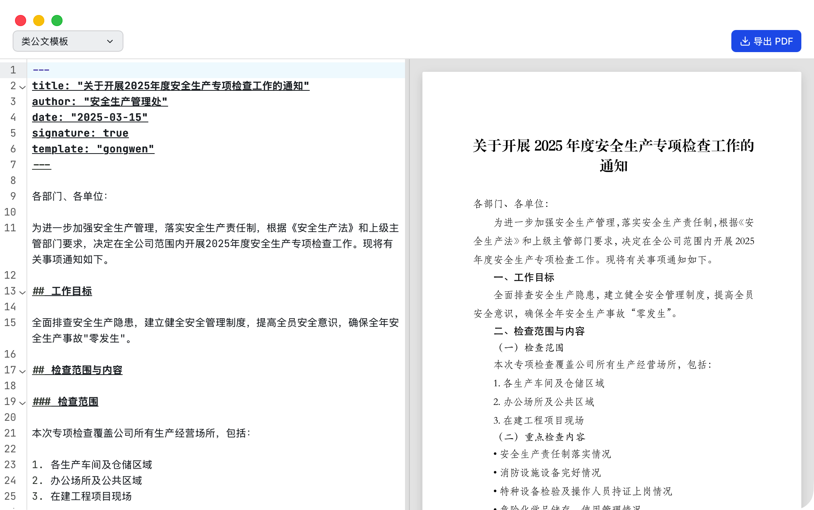
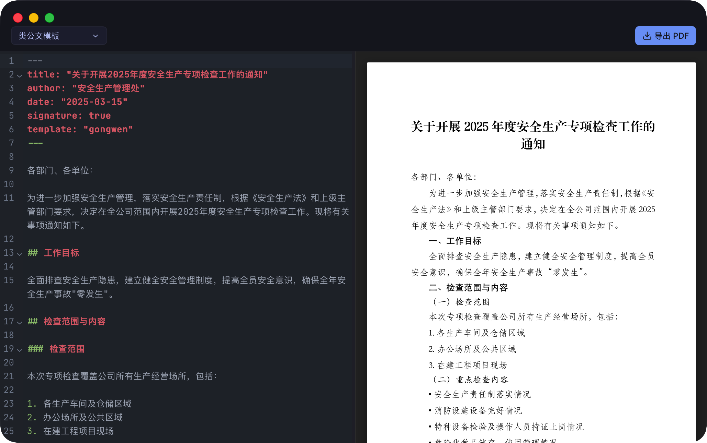
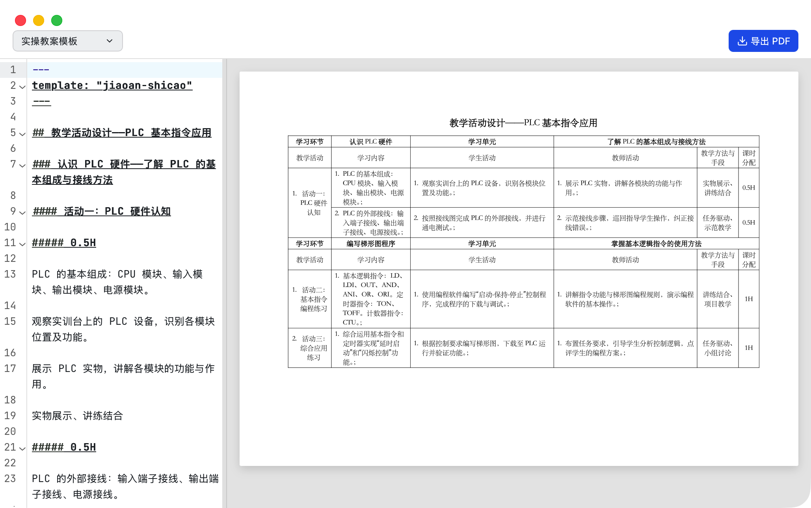
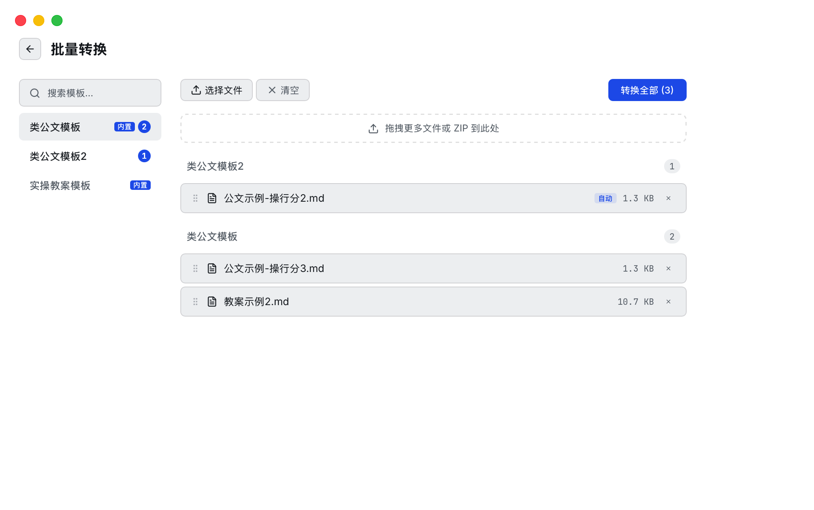
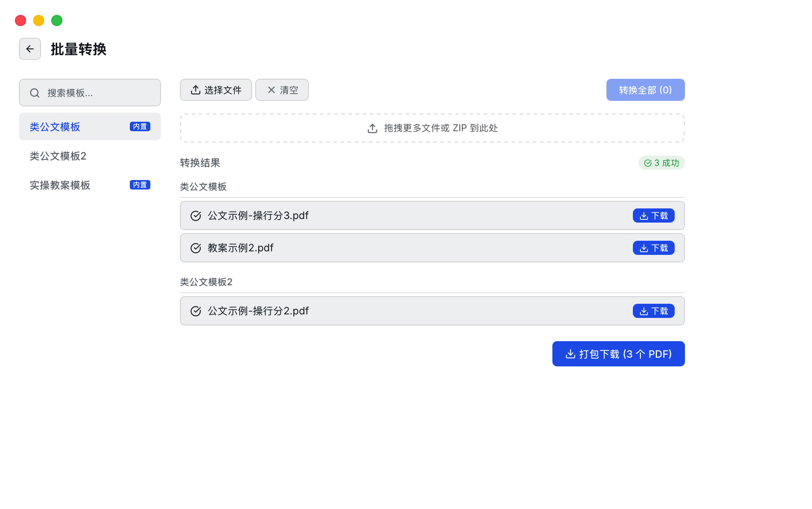
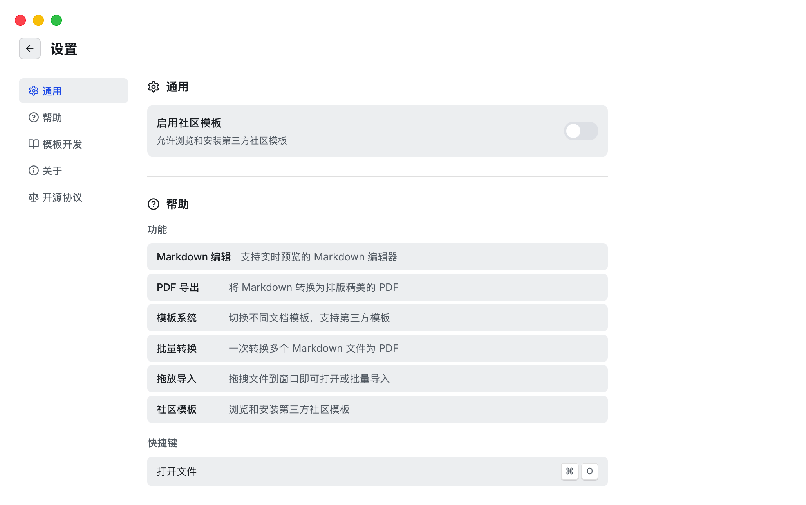
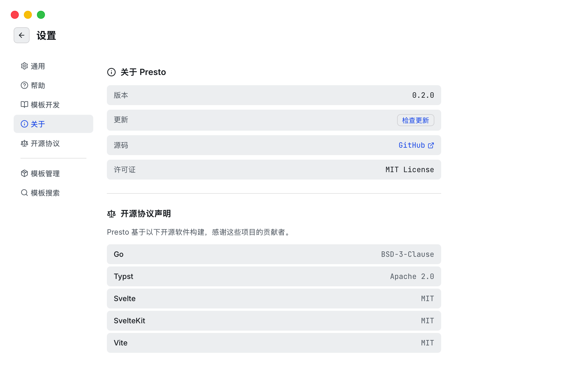
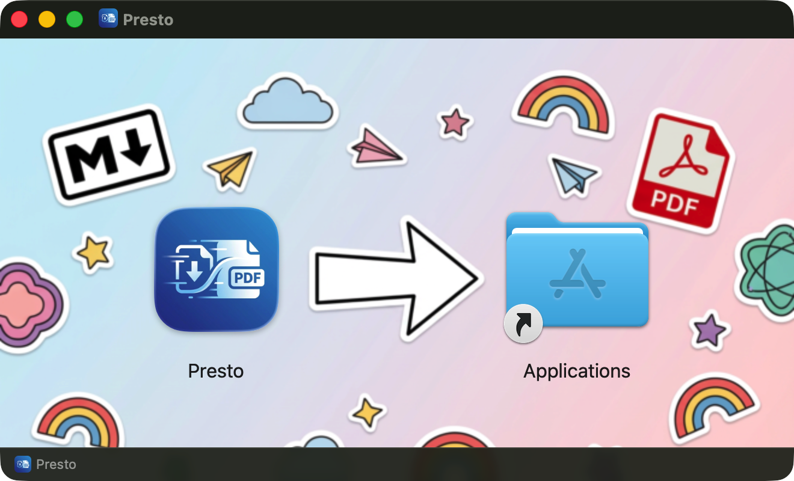
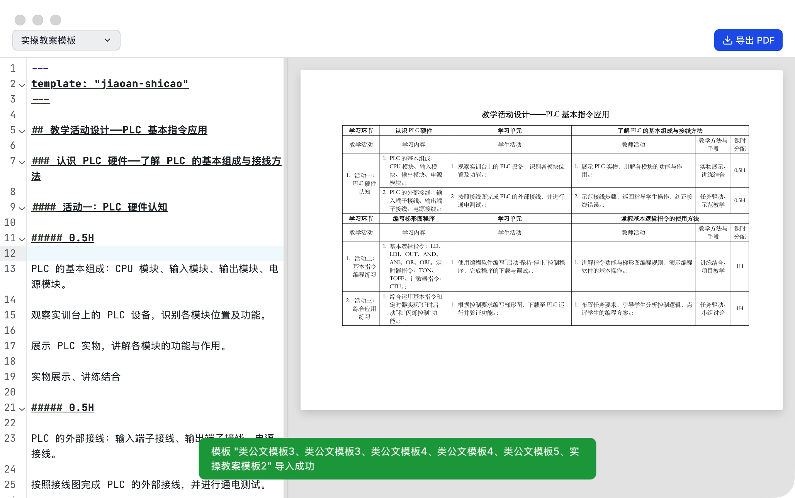

# Presto

Markdown → Typst → PDF，一站式文档转换平台。

[](https://go.dev)
[](https://svelte.dev)
[](https://wails.io)
[](https://typst.app)
[](LICENSE)

用 Markdown 写内容，选一个模板，Presto 帮你排版成专业 PDF。不用学 LaTeX，不用折腾 Word 样式。



## 功能特性

- **实时预览** — 编辑 Markdown，即时看到排版效果（SVG 渲染，支持多页）
- **编辑器与预览双向滚动同步**
- **CodeMirror 6 编辑器** — 语法高亮、中文搜索、自动换行
- **模板系统** — 插件化架构，模板是独立可执行文件，支持从 GitHub 安装第三方模板
- **批量转换** — 一次处理多个文件，并发转换，打包 ZIP 下载
- **拖放导入** — 拖拽文件到窗口即可打开或批量导入，支持 ZIP 包自动识别模板
- **模板自动检测** — 根据 YAML front matter 中的 `template` 字段自动匹配模板
- **深色模式** — 跟随系统主题自动切换
- **桌面端** — 原生 macOS 菜单栏、文件对话框、键盘快捷键
- **Web 端** — Docker 一键部署，浏览器直接使用
- **跨平台** — macOS（Universal）、Windows（amd64/arm64）、Linux（amd64/arm64）

## 截图

<details>
<summary><b>编辑器 — 深色模式</b></summary>



</details>

<details>
<summary><b>实操教案模板</b></summary>



</details>

<details>
<summary><b>批量转换</b></summary>






</details>

<details>
<summary><b>设置与模板管理</b></summary>






</details>

<details>
<summary><b>macOS 安装镜像</b></summary>



</details>

## 内置模板

| 模板 | 用途 | 说明 |
|------|------|------|
| `gongwen` | 类公文模板 | 符合 GB/T 9704-2012 标准，支持标题、作者、日期、签名等元素 |
| `jiaoan-shicao` | 实操教案模板 | 将 Markdown 格式的实操教案转换为标准表格排版 |

## 安装

### macOS（Homebrew）

```bash
brew install --cask brewforge/more/presto
```

### macOS / Windows / Linux（手动下载）

前往 [GitHub Releases](https://github.com/mrered/presto/releases) 下载对应平台的安装包。

### Docker 部署（Web 端）

```bash
docker compose up -d
```

浏览器打开 `http://localhost:8080`。

也可以使用预构建的多架构镜像：

```bash
docker run -d -p 8080:8080 -v presto-data:/home/presto/.presto ghcr.io/mrered/presto
```

## 从源码构建

### 前置依赖

- [Go 1.25+](https://go.dev/dl/)
- [Node.js 22+](https://nodejs.org/)
- [Typst 0.14+](https://github.com/typst/typst/releases)
- [Wails CLI](https://wails.io/docs/gettingstarted/installation)（仅桌面端需要）

### 开发模式

```bash
# 构建前端
make frontend

# 构建并安装模板
make templates && make install-templates

# 启动开发服务器
make dev
```

### 桌面端

```bash
make run-desktop
```

### 跨平台打包

```bash
# macOS
make dist-macos-arm64      # Apple Silicon .app
make dist-macos-amd64      # Intel .app
make dist-macos-universal  # Universal .app
make dist-dmg-universal    # Universal DMG

# Windows（需要 mingw-w64）
make dist-windows-amd64

# Linux（通过 Docker 构建）
make dist-linux-amd64

# 全平台
make dist
```

打包产物输出到 `dist/` 目录。macOS .app 会自动捆绑 Typst 二进制和内置模板到 `Contents/Resources/`。

## 使用指南

### 基本工作流

1. 在左侧编辑器中编写 Markdown 内容
2. 从顶部下拉菜单选择模板
3. 右侧实时预览排版效果
4. 点击导出按钮（或 `Cmd+E`）下载 PDF

### YAML Front Matter

模板通过 YAML front matter 接收元数据。以 `gongwen` 模板为例：

```markdown
---
title: 关于开展安全检查的通知
author: 办公室
date: "2025-03-15"
signature: true
---

正文内容...
```

不同模板支持的字段不同，具体参考模板的 `manifest.json` 中的 `frontmatterSchema`。

### 模板自动检测

在 front matter 中指定 `template` 字段，Presto 会自动匹配已安装的模板：

```markdown
---
template: gongwen
title: 通知标题
---
```

在批量转换时，每个文件的模板也会根据此字段自动分组。

### 批量转换

1. 进入批量转换页面
2. 选择文件或拖拽 Markdown 文件 / ZIP 包到页面
3. 文件会按模板自动分组，也可手动拖拽调整
4. 点击"转换全部"，并发处理
5. 单独下载或打包 ZIP 下载



### 拖放导入

直接拖拽文件到 Presto 窗口：

- **单个 Markdown 文件** → 在编辑器中打开
- **多个文件** → 自动跳转到批量转换页面
- **ZIP 包** → 自动识别其中的模板并安装，Markdown 文件进入批量转换

### 键盘快捷键

| 快捷键 | 功能 |
|--------|------|
| `Cmd+O` | 打开文件 |
| `Cmd+E` | 导出 PDF |
| `Cmd+,` | 打开设置 |
| `Cmd+Shift+T` | 模板管理 |
| `Cmd+F` | 编辑器内搜索 |

## 模板系统

Presto 的模板是独立的可执行文件，通过 stdin/stdout 协议与主程序通信：

```
Markdown (stdin) → 模板二进制 → Typst 源码 (stdout)
```

### 安装第三方模板

Presto 通过 GitHub Search API 发现带有 `presto-template` topic 的仓库。在设置 → 模板搜索页面可以浏览和一键安装。也支持从 ZIP 文件导入模板。

### 开发自定义模板

1. 创建一个程序（Go 或任意语言），从 stdin 读取 Markdown，向 stdout 输出 Typst 源码
2. 支持 `--manifest` 参数，输出 JSON 格式的模板元数据
3. 编写 `manifest.json`
4. 在 GitHub 仓库添加 `presto-template` topic
5. 创建 Release，上传各平台二进制文件（命名格式：`presto-template-{name}-{os}-{arch}`）

### manifest.json 格式

```json
{
  "name": "my-template",
  "displayName": "我的模板",
  "description": "模板描述",
  "version": "1.0.0",
  "author": "作者",
  "license": "MIT",
  "minPrestoVersion": "0.1.0",
  "frontmatterSchema": {
    "title": { "type": "string", "required": true },
    "author": { "type": "string" }
  }
}
```

## 技术架构

### 技术栈

| 层 | 技术 |
|----|------|
| 前端框架 | SvelteKit 2 + Svelte 5（runes 语法） |
| 编辑器 | CodeMirror 6 |
| 图标 | Lucide Svelte |
| 后端 | Go 标准库 `net/http` |
| 桌面框架 | Wails v2.11 |
| 排版引擎 | Typst CLI |
| 构建工具 | Vite 7 |
| 容器化 | Docker 多阶段构建 |

### 桌面端 vs Web 端

- **桌面端** (`presto-desktop`)：Wails 嵌入前端资源，通过 Wails binding 直接调用 Go 方法，绕过 HTTP 层
- **Web 端** (`presto-server`)：独立 HTTP 服务器，前端通过 fetch 调用 `/api/*` 端点
- 两者共享 `internal/` 层代码

### 项目结构

```
presto/
├── cmd/
│   ├── presto-desktop/    # Wails 桌面端入口
│   ├── presto-server/     # HTTP 服务器入口
│   ├── gongwen/           # 类公文模板
│   └── jiaoan-shicao/     # 实操教案模板
├── internal/
│   ├── api/               # HTTP 路由和处理器
│   ├── template/          # 模板管理、执行、GitHub 集成
│   └── typst/             # Typst CLI 封装
├── frontend/              # SvelteKit 前端
│   └── src/
│       ├── lib/
│       │   ├── api/       # API 客户端
│       │   ├── components/# Editor, Preview, TemplateSelector, Wizard
│       │   └── stores/    # 状态管理 (editor, templates, file-router, wizard)
│       └── routes/        # 页面: 主页、批量转换、设置
├── packaging/             # 平台打包配置 (macOS, Windows)
├── Dockerfile
├── docker-compose.yml
└── Makefile
```

## 贡献指南

欢迎提交 Issue 和 Pull Request。

### 开发环境搭建

```bash
git clone https://github.com/mrered/presto.git
cd presto
make templates && make install-templates
cd frontend && npm install && cd ..
make dev
```

### 提交规范

- 中文 commit 消息，格式 `<type>: <描述>`
- 类型：feat / fix / refactor / ui / sec / docs
- Go 代码遵循 `gofmt` 格式
- 前端使用 TypeScript strict，Svelte 5 runes 语法

## 开源协议

[MIT License](LICENSE)
